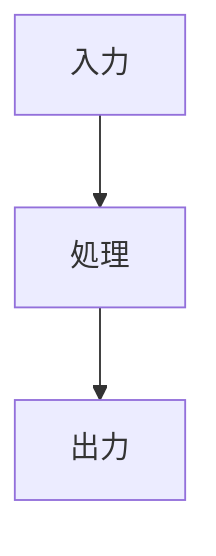

<!--
種別: テンプレート
対象: 設計ドキュメント
作成日: 2026-02-26
更新日: 2026-02-26
担当: AIエージェント
-->

# {タイトル}

## 概要

{1-2文でこのドキュメントが何を記述するか}

## 責務

{このモジュール/コンポーネントが担う責務を箇条書きで}

## インターフェース

### 入力

| パラメータ | 型 | 説明 |
|-----------|---|------|
| {name} | `{type}` | {説明} |

### 出力

| パラメータ | 型 | 説明 |
|-----------|---|------|
| {name} | `{type}` | {説明} |

## 内部構造

{クラス構成、関数構成、データフロー等}

## 設計判断

{このモジュールに固有の設計判断があれば記述。大きな判断はADRとして別途記録する}

## 関連ドキュメント

- [{関連ドキュメント名}]({相対パス})
