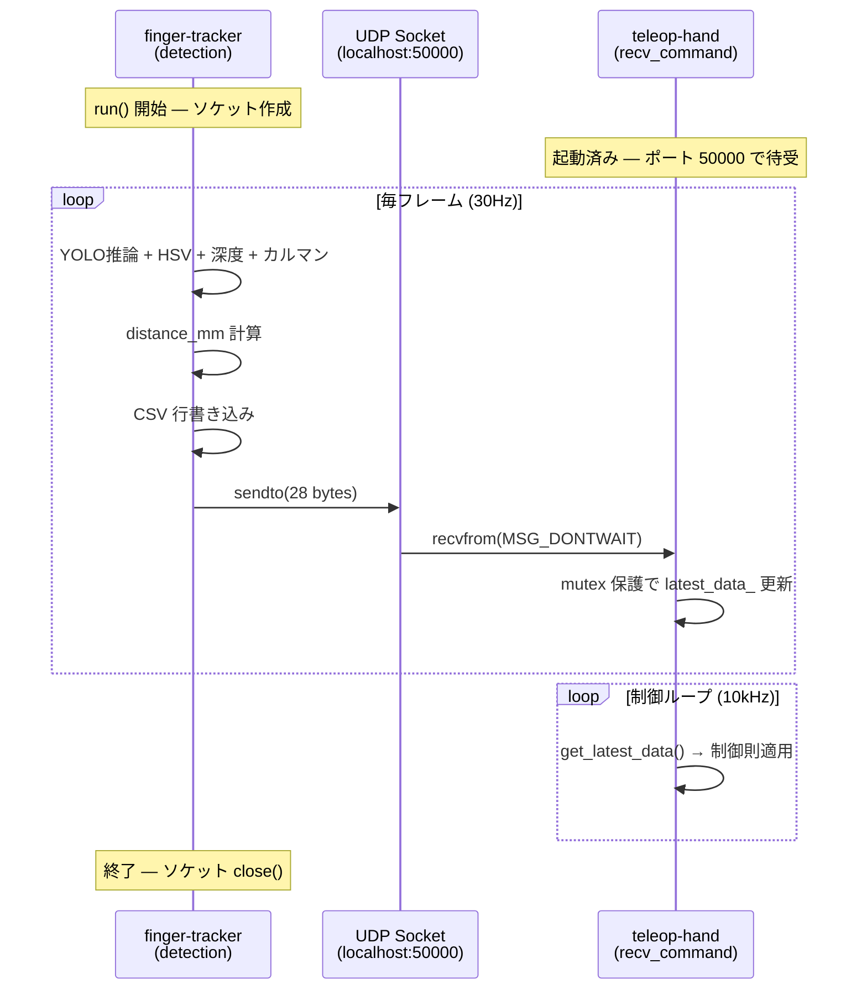

<!--
種別: decisions
対象: teleop-hand への計測データ送信方式
作成日: 2026-02-28
更新日: 2026-02-28
担当: AIエージェント
-->

# UDP データパブリッシャ

## 概要

finger-tracker の detection モジュールが計測した指間距離および指先3D座標を、teleop-hand（C++ リアルタイム制御システム）へリアルタイムに送信するための通信方式を決定する。

teleop-hand 側の受信実装（`inc/comm/udp_receiver.h`, `inc/comm/finger_data.h`）は既に完成しており、finger-tracker 側の送信機構を合わせる形で設計する。

## 設計判断

### 判断1: 通信プロトコル — UDP

**問題**: finger-tracker から teleop-hand へ 30Hz でリアルタイムに計測データを送る通信方式は何か

**選択肢**:

1. UDP ソケット（POSIX `socket.SOCK_DGRAM`）
2. TCP ソケット
3. 共有メモリ（`mmap` / `multiprocessing.shared_memory`）
4. ZeroMQ（PUB/SUB パターン）

**決定**: 選択肢1 — UDP

**理由**:

- teleop-hand 側が UDP 受信で実装済み（`udp_receiver.h`）であり、プロトコル変更は不要
- 30Hz のセンサデータは「最新値が常に正」であり、パケットロスしても次フレームで上書きされる。TCP の再送保証は不要かつ有害（遅延増加）
- Python 標準ライブラリ `socket` のみで実装でき、追加依存がない
- `localhost` 通信だが将来的にネットワーク越し（別PC上の teleop-hand）にも拡張可能

**トレードオフ**:

- **利点**: 低遅延、実装シンプル、追加依存なし、teleop-hand と既に互換
- **欠点**: パケットロスの検知・統計は自前で実装が必要（ただし localhost ではほぼロスなし）

### 判断2: パケット形式 — 28バイトバイナリ構造体

**問題**: 送信データのシリアライゼーション形式は何か

**選択肢**:

1. バイナリ構造体（`struct.pack` / リトルエンディアン float32 × 7）
2. JSON 文字列
3. MessagePack
4. Protocol Buffers

**決定**: 選択肢1 — バイナリ構造体

**理由**:

- teleop-hand 側が `finger_data` 構造体（28バイト固定長）で受信しており、バイト列の直接キャストで処理している
- `static_assert(sizeof(finger_data) == 28)` によるコンパイル時検証済み
- `struct.pack("<7f", ...)` 一行で完結し、シリアライゼーションのオーバーヘッドがゼロ

**パケットレイアウト**:

```
オフセット  型         フィールド      説明
0          float32    distance_mm    指間距離 [mm]。検出失敗時は -1.0
4          float32    red_x          親指 X 座標 [m]（カルマンフィルタ済み）
8          float32    red_y          親指 Y 座標 [m]
12         float32    red_z          親指 Z 座標 [m]
16         float32    blue_x         人差指 X 座標 [m]
20         float32    blue_y         人差指 Y 座標 [m]
24         float32    blue_z         人差指 Z 座標 [m]
合計: 28 bytes, リトルエンディアン (x86 ネイティブ)
```

対応する teleop-hand 側の構造体（`inc/comm/finger_data.h`）:

```cpp
struct finger_data {
  float distance_mm;
  float red_x, red_y, red_z;
  float blue_x, blue_y, blue_z;
};
static_assert(sizeof(finger_data) == 28, "finger_data must be 28 bytes for UDP transfer");
```

**トレードオフ**:

- **利点**: ゼロコピー受信（C++ 側）、固定長でパース不要、最小レイテンシ
- **欠点**: エンディアン依存（両端 x86 で問題なし）、フィールド追加時は両端の同時更新が必要

### 判断3: 送信タイミング — 毎フレーム無条件送信

**問題**: 検出成功時のみ送信するか、検出失敗時も送信するか

**選択肢**:

1. 毎フレーム無条件送信（検出失敗時は `distance_mm = -1.0`）
2. 検出成功時のみ送信

**決定**: 選択肢1 — 毎フレーム無条件送信

**理由**:

- teleop-hand 側は `distance_mm >= 0.0f` で有効パケットを判定しており、`-1.0` は「検出失敗」のセンチネル値として定義済み
- 毎フレーム送信することで teleop-hand 側がパケット到達率を監視でき、finger-tracker のプロセス停止を検知可能
- 送信しないと teleop-hand 側はパケットロスとプロセス停止の区別がつかない

**検出失敗時のパケット内容**:

```python
# distance_mm = -1.0, 座標は全て 0.0
struct.pack("<7f", -1.0, 0.0, 0.0, 0.0, 0.0, 0.0, 0.0)
```

**トレードオフ**:

- **利点**: teleop-hand 側でヘルスチェック可能、実装がシンプル（条件分岐なし）
- **欠点**: 無効パケットによる帯域消費（28 bytes × 30Hz = 840 B/s で無視できる）

### 判断4: 送信モジュール配置 — detection モジュール内

**問題**: UDP 送信ロジックをどこに配置するか

**選択肢**:

1. detection モジュールの `run()` ループ内に直接組み込む
2. 独立した `publisher` モジュールとして分離する

**決定**: 選択肢1 — detection モジュール内

**理由**:

- 送信データ（`distance_mm`, `red_pos`, `blue_pos`）は detection のループ内でしか生成されない
- CSV 記録と同列のデータ出力であり、分離する利点が薄い
- モジュールを増やすとパッケージ構造が複雑になる（ADR 009 の 4 モジュール構成との整合）

**実装箇所**: `src/finger_tracker/detection/__init__.py` の `run()` 関数内、CSV 行書き込み直後に送信処理を追加する

**トレードオフ**:

- **利点**: 既存構造を維持、データフローが明確
- **欠点**: detection モジュールの責務が増える（検出 + 表示 + CSV + UDP）

### 判断5: ソケットライフサイクル — アプリケーション起動時に1回作成

**問題**: UDP ソケットの生成・破棄タイミング

**選択肢**:

1. `run()` の初期化時に1回作成し、終了時に `close()`
2. 送信ごとにソケットを作成・破棄

**決定**: 選択肢1 — 起動時に1回作成

**理由**:

- ソケット生成はシステムコールであり、30Hz で毎回呼ぶのは無駄
- 既存のリソース管理パターン（RealSense pipeline, CSV writer）と一致
- `finally` ブロックまたは既存のクリーンアップ処理で確実に `close()` する

**トレードオフ**:

- **利点**: オーバーヘッド最小、リソース管理が一貫
- **欠点**: なし（UDP は connect 不要でステートレス）

### 判断6: 設定管理 — config.yaml に udp セクション追加

**問題**: 送信先アドレスとポートの管理方法

**選択肢**:

1. `config.yaml` に新規 `udp` セクションを追加
2. detection セクション内にネストする
3. ハードコードする

**決定**: 選択肢1 — `config.yaml` に `udp` セクション追加

**理由**:

- ADR 006 の設定管理方針（ハードコードせず YAML 管理）に準拠
- teleop-hand の `config/comm.json` のポート（50000）と対になる設定であり、独立したセクションが適切
- 将来的に送信先がリモートマシンに変わる可能性がある

**追加する設定項目**:

```yaml
udp:
  host: "127.0.0.1"    # teleop-hand の IP アドレス
  port: 50000           # teleop-hand の受信ポート（comm.json と一致）
  enabled: true         # false で送信を無効化（単体テスト時等）
```

**トレードオフ**:

- **利点**: 接続先の変更がコード修正不要、teleop-hand 未起動時でも finger-tracker を単体実行可能
- **欠点**: 設定ファイルの項目が増える（最小限に留めている）

## 送信実装の概要

```python
import socket
import struct

# 初期化（run() 冒頭）
udp_cfg = config.get("udp", {})
udp_enabled = udp_cfg.get("enabled", True)
if udp_enabled:
    udp_sock = socket.socket(socket.AF_INET, socket.SOCK_DGRAM)
    udp_dest = (udp_cfg.get("host", "127.0.0.1"), udp_cfg.get("port", 50000))

# 毎フレーム送信（CSV 書き込み直後）
if udp_enabled:
    if distance_mm is not None:
        packet = struct.pack("<7f", distance_mm, *red_pos, *blue_pos)
    else:
        packet = struct.pack("<7f", -1.0, 0.0, 0.0, 0.0, 0.0, 0.0, 0.0)
    udp_sock.sendto(packet, udp_dest)

# クリーンアップ（finally ブロック）
if udp_enabled:
    udp_sock.close()
```

## シーケンス図



## 起動順序

finger-tracker と teleop-hand の起動順序は任意。

- **teleop-hand が先に起動**: ポート 50000 で待受開始。finger-tracker 起動まではパケットなし（`valid_ = false` のまま）
- **finger-tracker が先に起動**: `sendto` は相手の受信有無に関係なく成功する（UDP の性質）。teleop-hand 起動後に即座に受信開始

## 関連ドキュメント

- [002-depth-measurement-logic.md](./002-depth-measurement-logic.md) — カルマンフィルタ済み3D座標の算出
- [006-config-management.md](./006-config-management.md) — config.yaml 管理方針
- [007-logging-recording.md](./007-logging-recording.md) — CSV 記録（送信と並行）
- [008-error-handling.md](./008-error-handling.md) — グレースフルシャットダウン（ソケット close 含む）
- teleop-hand: `inc/comm/finger_data.h` — パケット構造体定義
- teleop-hand: `inc/comm/udp_receiver.h` — UDP 受信クラス
- teleop-hand: `config/comm.json` — 受信ポート設定
